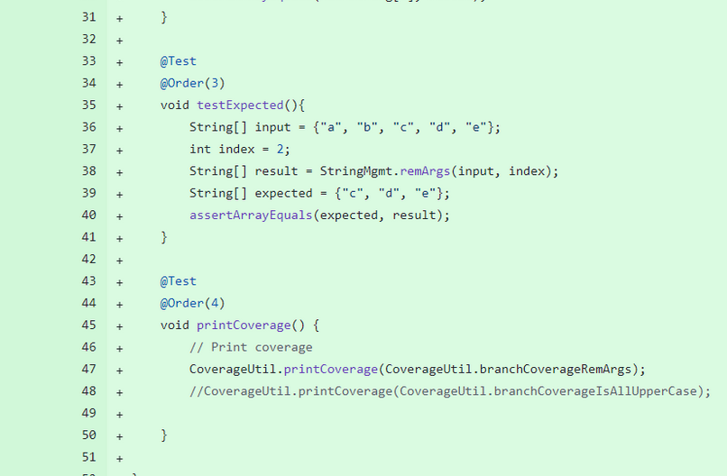
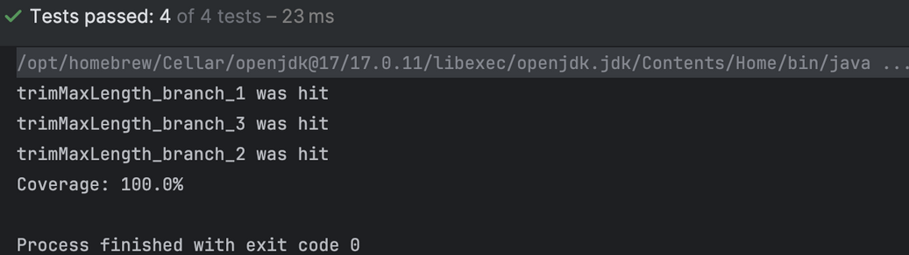
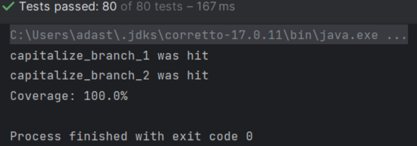

# Report for Assignment 1

## Project chosen

Name: Towny

URL: https://github.com/lil-Addy-D/Towny_SEP_group58

Number of lines of code and the tool used to count it:

62 thousand lines, we used lizard to count the lines of code in the project as per recommendation by the course team.

Programming language: Java

## Coverage measurement

### Existing tool

We used an inbuilt coverage tool in the intellij IDEA. We chose “Run ‘All Tests’ with Coverage”.

This is the coverage results that we got:

### Your own coverage tool

At first we as a group created a helper Utility file in which we put our global structures and helper functions. Later we created a separate test for printing coverage to the console which is executed last. For easier readability while reporting on coverage for separate functions we only printed the coverage information for the selected function. Here are the results. We do not repeat the shared code in each of our parts separately. The functions in a shared file are very similar, just mainly the names are different.
package com.palmergames.util;

      import java.util.HashMap;
      import java.util.Map;

      public class CoverageUtil {
         public static final Map<String, Boolean> branchCoverageRemArgs = new HashMap<>();
         public static final Map<String, Boolean> branchCoverageSubArray = new HashMap<>();
         public static final Map<String, Boolean> branchCoverageIsAllUpperCase = new HashMap<>();
         public static final Map<String, Boolean> branchCoverageCapitalize = new HashMap<>();
         public static final Map<String, Boolean> branchCoverageContainsIgnoreCase = new HashMap<>();
         public static final Map<String, Boolean> branchCoverageParseOnOff = new HashMap<>();
         public static final Map<String, Boolean> branchCoverageTrimMaxLength = new HashMap<>();
         public static final Map<String, Boolean> branchCoverageCheckOrCreateFolder = new HashMap<>();
         
         static {
            branchCoverageRemArgs.put("remArgs_branch_1", false);
            branchCoverageRemArgs.put("remArgs_branch_2", false);
            branchCoverageRemArgs.put("remArgs_branch_3", false);
         }
      
         static {
            branchCoverageIsAllUpperCase.put("isAllUpperCase_branch_1", false);
            branchCoverageIsAllUpperCase.put("isAllUpperCase_branch_2", false);
            branchCoverageIsAllUpperCase.put("isAllUpperCase_branch_3", false);
         }
      
         static {
            branchCoverageSubArray.put("subArray_branch_1", false);
            branchCoverageSubArray.put("subArray_branch_2", false);
            branchCoverageSubArray.put("subArray_branch_3", false);
         }
      
         static {
            branchCoverageCapitalize.put("capitalize_branch_1", false);
            branchCoverageCapitalize.put("capitalize_branch_2", false);
         }
      
         static {
            branchCoverageContainsIgnoreCase.put("containsIgnoreCase_branch_1", false);
            branchCoverageContainsIgnoreCase.put("containsIgnoreCase_branch_2", false);
         }
      
         static {
            branchCoverageParseOnOff.put("parseOnOff_branch_1", false);
            branchCoverageParseOnOff.put("parseOnOff_branch_2", false);
            branchCoverageParseOnOff.put("parseOnOff_branch_3", false);
         }

         static {
            branchCoverageTrimMaxLength.put("trimMaxLength_branch_1", false);
            branchCoverageTrimMaxLength.put("trimMaxLength_branch_2", false);
            branchCoverageTrimMaxLength.put("trimMaxLength_branch_3", false);
         }

         static {
            branchCoverageCheckOrCreateFolder.put("checkOrCreateFolder_branch_1", false);
            branchCoverageCheckOrCreateFolder.put("checkOrCreateFolder_branch_2", false);
         }    
         
         public static void coverBranchRemArgs(String branchName) { branchCoverageRemArgs.put(branchName, true); }
         public static void coverBranchSubArray(String branchName) { branchCoverageSubArray.put(branchName, true); }
         public static void coverBranchIsAllUpperCase(String branchName) { branchCoverageIsAllUpperCase.put(branchName, true); }
         public static void coverBranchCapitalize(String branchName) { branchCoverageCapitalize.put(branchName, true); }
         public static void coverBranchContainsIgnoreCase(String branchName) { branchCoverageContainsIgnoreCase.put(branchName, true); }
         public static void coverBranchParseOnOff(String branchName) { branchCoverageParseOnOff.put(branchName, true); }
         public static void coverBranchTrimMaxLength(String branchName) { branchCoverageTrimMaxLength.put(branchName, true); }
         public static void coverBranchCheckOrCreateFolder(String branchName) { branchCoverageCheckOrCreateFolder.put(branchName, true); }
      
         public static void printCoverage(Map<String, Boolean> branchCoverage) {
            int coveredCount = 0;
            for (Map.Entry<String, Boolean> entry : branchCoverage.entrySet()) {
               System.out.println(entry.getKey() + " was " + (entry.getValue() ? "hit" : "not hit"));
               if (entry.getValue()) {
                  coveredCount++;
               }
            }
            double coveragePercentage = (coveredCount / (double) branchCoverage.size()) * 100;
            System.out.println("Coverage: " + coveragePercentage + "%");
         }
      }

Also for formatting this is not a diff screenshot because it was added from scratch and each of us modified it therefore screenshot of a diff would be confusing with new things being added step by step.

### Domas Davidavicius

Function 1: public static String[] remArgs(String[] arr, int startFromIndex)

https://github.com/TownyAdvanced/Towny/commit/48d7877cd387e0aa5180687921c603d974164479

Coverage results output by the instrumentation:

This function was not tested therefore the coverage of it is 0.

Function 2: public static boolean isAllUpperCase(@NotNull String string)

https://github.com/TownyAdvanced/Towny/commit/88859586a1df6b2427dd8bbfdf6d01f39e32e061

This function was not tested therefore the coverage of it is 0.

### Benas Pranauskas

Function 1: public static boolean containsIgnoreCase(List<String> arr, String str)

Coverage results output by the instrumentation:

Function 2: public static boolean parseOnOff(String s)

Coverage results output by the instrumentation:

### Matteo Davidhi

Function 1: public static boolean checkOrCreateFolder(String folderPath)

Coverage results output by the instrumentation:

Function 2: public static String trimMaxLength(String str, int length)

Coverage results output by the instrumentation:

### Adas Triaušys

Function 1: public static String[] subArray(String[] arr, int start, int end)

https://github.com/lil-Addy-D/Towny_SEP_group58/compare/e97942a4de075cc589b00d8b1e50c2656d76035a...5c5ebdca1e6d2afcdd335521008c1760678b6536

Coverage results output by the instrumentation:

Function 2: public static String capitalize(String str)

Coverage results output by the instrumentation:

## Coverage improvement

### Individual tests

### Domas Davidavicius

Test 1

https://github.com/TownyAdvanced/Towny/commit/1b40cc66353ef6e1a5ce94eadfd8531dad5effbf

Coverage before:

Coverage after:

I added the tests for this function which was not previously tested. Since I made sure to cover all of the branches the new coverage is 100 %. It got improved by 100% as well since 100 - 0 = 100. The coverage is improved because now the function is actually being tested and I made sure that tests cover all of the branches.

Test 2

https://github.com/TownyAdvanced/Towny/commit/e97942a4de075cc589b00d8b1e50c2656d76035a

Coverage before:

Coverage after:

As for the first function I added the tests for this function which was not previously tested. Since I made sure to cover all of the branches the new coverage is 100%. It got improved by 100% as well since 100 - 0 = 100. The coverage is improved because now the function is actually being tested compared to before and I made sure that tests cover all of the branches.

### Benas Pranauskas

Test 1

Coverage before:

Coverage after:

Similarly to other methods we’ve tested, I added the tests for this function which was not previously tested. Since I made sure to cover all of the branches, the new coverage is 100%. It got improved by 100% as well since 100 - 0 = 100. The coverage is improved because now the function is actually being tested compared to before and I made sure that tests cover all of the branches.

Test 2

Coverage before:

Coverage after:

Similarly to other methods we’ve tested, I added the tests for this function which was not previously tested. Since I made sure to cover all of the branches, the new coverage is 100%. It got improved by 100% as well since 100 - 0 = 100. The coverage is improved because now the function is actually being tested compared to before and I made sure that tests cover all of the branches.

### Matteo Davidhi

Test 1

Coverage before:

Coverage after:

The function was not previously tested at all, and I have created tests for all the branches of the function, so the branch coverage went from 0 to 100 percent, meaning each branch of the selected function is executed at least once by a test.

Test 2

Coverage before:

Coverage after:

The function was not previously tested at all, and I have created tests for all the branches of the function, so the branch coverage went from 0 to 100 percent, meaning each branch of the selected function is executed at least once by a test.

### Adas Triaušys

Test 2

Coverage before:

Coverage after:

The coverage of subArray function increased by 100% because before it was not tested at all, and I created tests for it while making sure that the tests reach every branch of the function, hence the increase in coverage.

Test 2

Coverage before:

Coverage after:

Again, the coverage went from being 0% to being 100% 

### Overall

Overall coverage before:

Overall coverage after:

As can be seen from the two screenshots branch coverage for StringMgmt class was improved from 7% to 60%, and from 2% to 4% for FileMgmt.

## Statement of individual contributions

Domas created the backbone of the shared file, did coverage tools and tests for the two functions mentioned above. Helped edit the document and did a quality check.
Adas forked the repository and managed the gitHub matters of the assignment, made coverage tools and tests for his selected functions and formatted the read.me file.
Benas found the Towny project and ensured it can be ran on our machines, implemented coverage measures and branch tests that improve the coverage for his selected methods.
Matteo provided the coverage results using the existing tool, implemented coverage tests and coverage tool for his assigned functions and provided some extra information about the topic in question (coverage).
